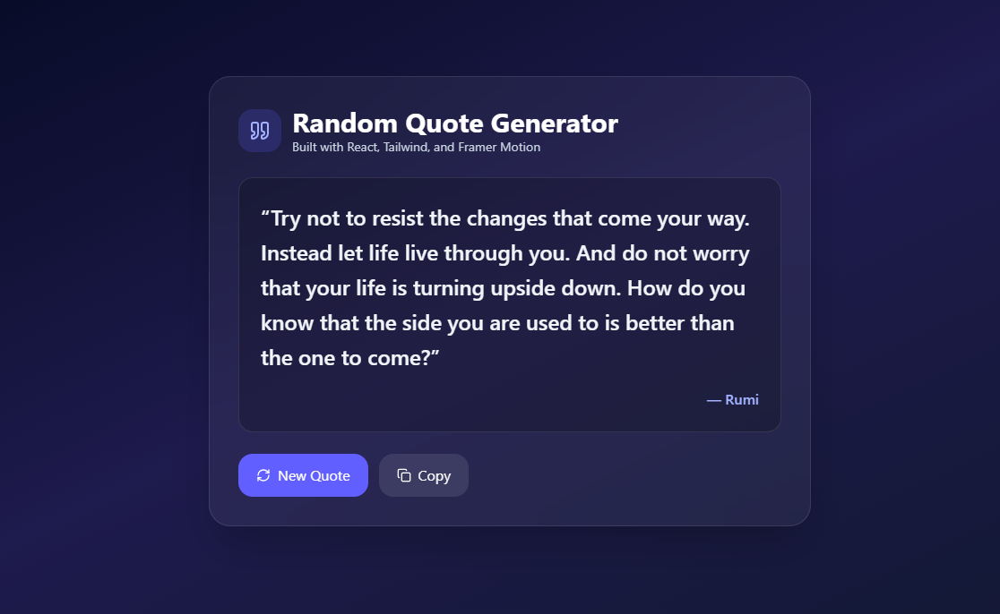
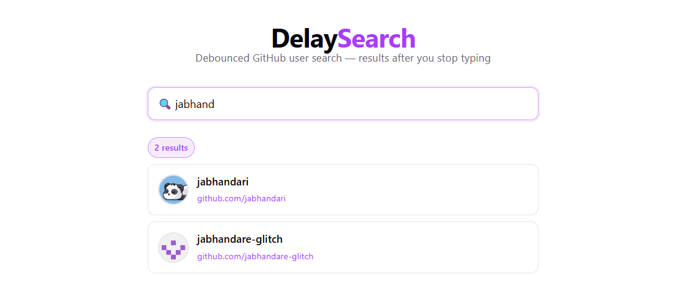

# 100 Days of Code

A collection of projects built during the #100DaysOfCode challenge — one project per day, covering different languages, frameworks, and concepts.

---

## Index

| Day | Project | Stack | Folder |
|---|---|---|---|
| [Day 1](#day-1--to-do-list) | [To-Do List](todo_app/README.md) | C++ | [`todo_app/`](todo_app/) |
| [Day 2](#day-2--simple-calculator) | [Simple Calculator](simple_calculator/readme.md) | HTML / CSS / JavaScript | [`simple_calculator/`](simple_calculator/) |
| [Day 3](#day-3--random-quote-generator) | [Random Quote Generator](random_quote_generator/random-quote-generator/README.md) | React + TypeScript + Tailwind + Framer Motion | [`random_quote_generator/`](random_quote_generator/random-quote-generator/) |
| [Day 4](#day-4--delaysearch) | [DelaySearch](debounce_search_app/debounce_search_app/README.md) | React + Vite | [`debounce_search_app/`](debounce_search_app/debounce_search_app/) |
| [Day 5](#day-5--dresscord) | [Dresscord](dresscord/README.md) | Node.js | [`dresscord/`](dresscord/) |
| [Day 6](#day-6--git-pull-reminder) | [Git Pull Reminder](git_pull_reminder/README.md) | TypeScript + VS Code API | [`git_pull_reminder/`](git_pull_reminder/) |

---

## Projects

### Day 1 — To-Do List

> **Folder:** [`todo_app/`](todo_app/) &nbsp;|&nbsp; **Language:** C++

A command-line task manager. Add, view, complete, and remove tasks from the terminal.

**Key concepts:** OOP (structs & classes), user input handling, CLI menus

---

### Day 2 — Simple Calculator

> **Folder:** [`simple_calculator/`](simple_calculator/) &nbsp;|&nbsp; **Language:** HTML / CSS / JavaScript

A browser-based calculator supporting basic arithmetic with edge-case handling (consecutive operators, multiple decimals).

**Key concepts:** DOM manipulation, event handling, expression evaluation

---

### Day 3 — Random Quote Generator

> **Folder:** [`random_quote_generator/random-quote-generator/`](random_quote_generator/random-quote-generator/) &nbsp;|&nbsp; **Stack:** React + TypeScript + Tailwind + Framer Motion

A web app that fetches a random quote from an API and displays it with smooth animations. Includes copy-to-clipboard functionality.

**Key concepts:** React hooks, async fetch, Tailwind CSS v4, Framer Motion animations



---

### Day 4 — DelaySearch

> **Folder:** [`debounce_search_app/debounce_search_app/`](debounce_search_app/debounce_search_app/) &nbsp;|&nbsp; **Stack:** React + Vite

A debounced GitHub user search app. Waits until you stop typing before calling the GitHub API — no redundant requests, smooth experience. Results display user avatars and link directly to GitHub profiles.

**Key concepts:** debouncing, custom React hooks, `useEffect` cleanup, GitHub REST API

<!-- Add screenshot below once captured -->



---

### Day 5 — Dresscord

> **Folder:** [`dresscord/`](dresscord/) &nbsp;|&nbsp; **Stack:** Node.js

A script that fetches today's weather forecast for a given location and posts a clothing suggestion to a Discord channel via webhook. Uses the free Open-Meteo API — no API key required. Runs daily via GitHub Actions.

**Key concepts:** async/await, REST API consumption, Discord webhooks, GitHub Actions scheduling

<!-- Add screenshot below once captured -->


---

### Day 6 — Git Pull Reminder

> **Folder:** [`git_pull_reminder/`](git_pull_reminder/) &nbsp;|&nbsp; **Stack:** TypeScript + VS Code Extension API

A published VS Code extension that pops up a reminder to pull the latest Git changes every time you open a workspace. Clicking **Pull Now** runs `git pull` directly from the notification — no terminal needed.

**Status: Installed and working** — the packaged `.vsix` is included in the repo and ready to install.

**Key concepts:** VS Code Extension API, TypeScript, extension activation lifecycle, command registration

<!-- Add screenshot below once captured -->


#### Quick install

```bash
code --install-extension git_pull_reminder/git-pull-reminder-0.0.1.vsix
```

Or: Extensions panel (`Ctrl+Shift+X`) → `···` menu → **Install from VSIX…** → select the file.

---

## Quick Start

| Project | How to run |
|---|---|
| To-Do List | `cd todo_app && g++ -o todoList toDoList.cpp && ./todoList` |
| Simple Calculator | Open `simple_calculator/index.html` in a browser |
| Random Quote Generator | `cd random_quote_generator/random-quote-generator && npm install && npm run dev` |
| DelaySearch | `cd debounce_search_app/debounce_search_app && npm install && npm run dev` |
| Dresscord | `cd dresscord && npm install && node index.js` |
| Git Pull Reminder | `code --install-extension git_pull_reminder/git-pull-reminder-0.0.1.vsix` |

---

## Repository Structure

```
100DaysCoding/
├── todo_app/                          # Day 1 — C++ CLI to-do list
├── simple_calculator/                 # Day 2 — Vanilla JS calculator
├── random_quote_generator/            # Day 3 — React quote app
│   └── random-quote-generator/
├── debounce_search_app/               # Day 4 — DelaySearch (React)
│   └── debounce_search_app/
├── dresscord/                         # Day 5 — Discord weather bot (Node.js)
├── git_pull_reminder/                 # Day 6 — VS Code extension (TypeScript)
│   └── git-pull-reminder-0.0.1.vsix  #         ← install this
└── docs/
    └── screenshots/                   # Project screenshots
```
