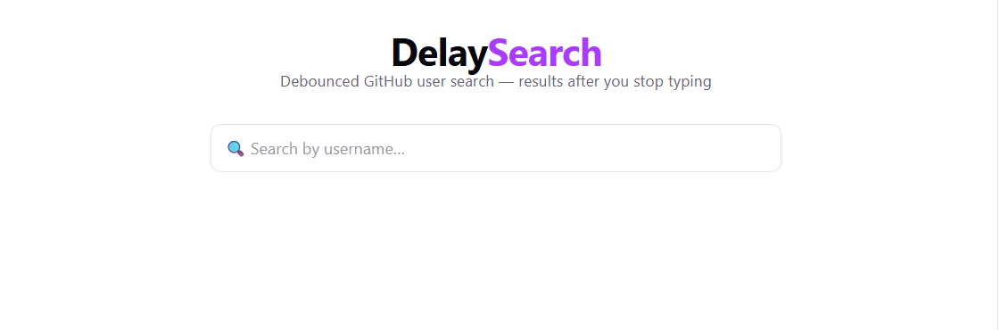

# DelaySearch

A debounced GitHub user search app built with React. Waits until you stop typing before firing the API request — no redundant calls, smooth UX.

---

## Screenshots

<!-- Add screenshots below once captured -->




---

## Features

- Debounced input — API only called 500 ms after the user stops typing
- Live GitHub user results with avatars
- Clickable cards linking directly to each profile
- Loading spinner during fetch
- "No results" state for empty queries
- Light / dark mode via system preference

---

## Tech Stack

| Layer | Tool |
|---|---|
| Framework | React 19 |
| Build tool | Vite |
| API | GitHub REST API (`/search/users`) |
| Styling | Plain CSS with CSS custom properties |

---

## Getting Started

```bash
cd debounce_search_app/debounce_search_app
npm install
npm run dev
```

Then open [http://localhost:5173](http://localhost:5173).

---

## How Debouncing Works

```
User types "jab"
  keystroke j  → timer starts (500 ms)
  keystroke a  → timer resets
  keystroke b  → timer resets
  ...500 ms pass with no keystroke...
  → fetch("https://api.github.com/search/users?q=jab")
```

The `useDebounce` hook in [src/hooks/useDebounce.js](src/hooks/useDebounce.js) wraps `setTimeout` / `clearTimeout` inside a `useEffect` to delay updating the value passed to the API call.

---

## Project Structure

```
src/
├── components/
│   └── Search.jsx        # Main search UI + fetch logic
├── hooks/
│   └── useDebounce.js    # Reusable debounce hook
├── styles/
│   └── search.css        # Component styles
├── index.css             # Global CSS variables + base styles
└── main.jsx              # React root entry point
```
