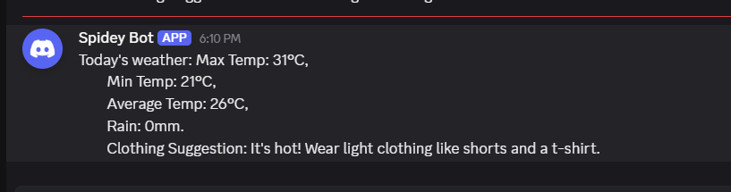

# Dresscord

A Node.js script that fetches today's weather forecast for a location and posts a clothing suggestion directly to a Discord channel via webhook.

---

## Screenshots



---

## How It Works

1. Calls the [Open-Meteo](https://open-meteo.com/) free weather API with a latitude/longitude to get today's max temp, min temp, and precipitation
2. Computes the average temperature and picks a clothing suggestion based on three temperature bands
3. Appends an umbrella reminder if any rain is forecast
4. Posts the full message to a Discord channel via a webhook URL

```
getWeather()  →  suggestClothing()  →  sendToDiscord()
```

---

## Clothing Logic

| Average Temp | Suggestion |
|---|---|
| > 25 °C | Light clothing — shorts and t-shirt |
| 15 – 25 °C | Light jacket or sweater |
| < 15 °C | Coat, scarf, and gloves |
| Rain > 0 mm | + umbrella reminder appended |

---

## Tech Stack

| Layer | Tool |
|---|---|
| Runtime | Node.js |
| HTTP client | axios |
| Weather API | Open-Meteo (free, no key required) |
| Notification | Discord Incoming Webhook |

---

## Getting Started

### 1. Install dependencies

```bash
cd dresscord
npm install
```

### 2. Set your location

Edit the coordinates at the top of [index.js](index.js):

```js
const latitude  = 40.7128;  // your latitude
const longitude = -74.0060; // your longitude
```

### 3. Set your Discord webhook URL

Replace the `webhookUrl` value in [index.js](index.js) with your own webhook.  
To create one: **Discord Server Settings → Integrations → Webhooks → New Webhook → Copy URL**

```js
const webhookUrl = 'https://discord.com/api/webhooks/YOUR_ID/YOUR_TOKEN';
```

### 4. Run

```bash
node index.js
```

---

## Project Structure

```
dresscord/
├── index.js        # All logic — fetch, suggest, post
├── package.json
└── package-lock.json
```

---

## API Reference

**Open-Meteo forecast endpoint used:**

```
GET https://api.open-meteo.com/v1/forecast
  ?latitude=<lat>
  &longitude=<lon>
  &daily=temperature_2m_max,temperature_2m_min,precipitation_sum
  &timezone=auto
```

Response shape accessed:

```js
data.daily.temperature_2m_max[0]   // today's high (°C)
data.daily.temperature_2m_min[0]   // today's low  (°C)
data.daily.precipitation_sum[0]    // today's rain (mm)
```
