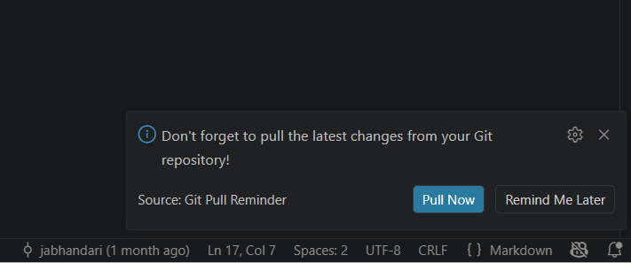

# Git Pull Reminder

A lightweight VS Code extension that reminds you to pull the latest changes every time you open a workspace — so you never start coding on a stale branch again.

> Already published and installed. You can grab the `.vsix` directly from this repo.

---

## Screenshots

<!-- Add screenshots below once captured -->



---

## Features

- Automatically shows a reminder notification 12 seconds after opening any workspace
- **Pull Now** button triggers `git pull` directly from the notification — no terminal needed
- **Remind Me Later** dismisses without doing anything
- Can be disabled per-workspace via VS Code settings
- Manually trigger the reminder any time via the Command Palette

---

## Installation

### Option 1 — Install from the `.vsix` file (recommended)

The packaged extension is included in this repo at [`git-pull-reminder-0.0.1.vsix`](git-pull-reminder-0.0.1.vsix).

**Via VS Code UI:**
1. Open VS Code
2. Go to the **Extensions** panel (`Ctrl+Shift+X` / `Cmd+Shift+X`)
3. Click the **`···`** menu (top-right of the Extensions panel)
4. Select **Install from VSIX…**
5. Navigate to and select `git-pull-reminder-0.0.1.vsix`
6. Reload VS Code when prompted

**Via terminal:**
```bash
code --install-extension git-pull-reminder-0.0.1.vsix
```

### Option 2 — Build and install from source

```bash
# 1. Clone the repo and enter the project
cd git_pull_reminder

# 2. Install dependencies
npm install

# 3. Compile TypeScript
npm run compile

# 4. Package into a .vsix (requires vsce)
npm install -g @vscode/vsce
vsce package

# 5. Install the generated .vsix
code --install-extension git-pull-reminder-0.0.1.vsix
```

---

## Usage

Once installed, the extension works automatically:

| Action | How |
|---|---|
| Auto reminder on workspace open | Fires 12 s after VS Code starts with a folder open |
| Pull immediately | Click **Pull Now** in the notification |
| Dismiss | Click **Remind Me Later** or press `Esc` |
| Trigger manually | `Ctrl+Shift+P` → `Git Pull Reminder: Check Pull` |
| Disable the extension | Set `gitPullReminder.enabled` to `false` in settings |

---

## Configuration

| Setting | Type | Default | Description |
|---|---|---|---|
| `gitPullReminder.enabled` | `boolean` | `true` | Show the reminder when opening a workspace |

To disable, add this to your VS Code `settings.json`:

```json
{
  "gitPullReminder.enabled": false
}
```

---

## How It Works

```
VS Code opens a workspace
  └─ activate() runs (onStartupFinished)
       └─ reads gitPullReminder.enabled
            ├─ false → exits silently
            └─ true  → setTimeout 12 000 ms
                          └─ showPullReminder()
                               ├─ "Pull Now"        → git.pull command
                               └─ "Remind Me Later" → dismiss
```

The extension registers one command (`gitPullReminder.checkPull`) that can also be called directly from the Command Palette at any time.

---

## Project Structure

```
git_pull_reminder/
├── src/
│   └── extension.ts              # All extension logic
├── out/                          # Compiled JS (generated by tsc)
├── git-pull-reminder-0.0.1.vsix  # Packaged extension — install this
├── package.json                  # Extension manifest
└── tsconfig.json
```

---

## Tech Stack

| Layer | Tool |
|---|---|
| Language | TypeScript |
| Runtime | VS Code Extension API |
| Build | `tsc` (TypeScript compiler) |
| Packaging | `@vscode/vsce` |
